# 🛍️ Inventory & Billing System

A full-stack **Inventory + Point-of-Sale (POS) management system** for a multi-branch retail
shop. Django REST Framework API on the backend, React + TypeScript SPA on the frontend.

Covers the full retail loop: **buy stock from suppliers → hold it per branch → sell it at a
GST-compliant POS terminal → track customer dues, loyalty, low stock and daily revenue on a
dashboard.** Role-based access separates what an Admin, a Manager and a Cashier can each do.

---

## Walkthrough

A full tour of the running application — every screen, captured live from the app with
`seed_demo_data` loaded: sign-in, admin sign-up, the dashboard, Billing / POS, Sales
History, Products, Stock & Movements, Purchases, Suppliers, Customers, User Management
and Store Settings.

| Format | File | Notes |
|--------|------|-------|
| **Video** | [`docs/walkthrough.mp4`](docs/walkthrough.mp4) | 1080p H.264, ~36 s — upload / share anywhere |
| **Slideshow** | [`docs/slideshow.html`](docs/slideshow.html) | open in a browser — autoplay, arrow-key navigation |
| **Screenshots** | [`docs/screenshots/`](docs/screenshots/) | 12 full-page images, one per screen (`docs/screenshots-4k/` = same set capped at 4000&nbsp;px) |
| **Animated SVG** | [`docs/demo.svg`](docs/demo.svg) | lightweight, plays inline on GitHub |



### Regenerating

- **Screenshots + video + slideshow** — start both servers and run `seed_demo_data`
  (see below), then from the repo root run `python docs/capture.py`. It creates a
  throwaway `_capture_bot` admin, installs `puppeteer-core` + `ffmpeg-static` into
  `docs/` on first run, drives headless Chrome through every route, and deletes the
  temp user afterwards.
- **Animated SVG** — `python docs/gen_demo.py` (stdlib only) after changing seed data.
- The scene-by-scene narration script for a hand-recorded video is in
  [`DEMO_SCRIPT.md`](./DEMO_SCRIPT.md); a stylised reel is at
  [`demo/walkthrough.html`](demo/walkthrough.html).

---

## Table of contents

- [Walkthrough](#walkthrough)
- [Features](#-features)
- [Tech stack](#-tech-stack)
- [Architecture](#-architecture)
- [Getting started](#-getting-started)
- [Demo data](#-demo-data)
- [Demo walkthrough / recording a video](#-demo-walkthrough--recording-a-video)
- [Roles & permissions](#-roles--permissions)
- [API reference](#-api-reference)
- [Project layout](#-project-layout)

---

## ✨ Features

### Billing / POS terminal (`/billing`)
- Live product search by **name, SKU or barcode**, plus a click-to-add catalog grid.
- Per-line quantity, discount and **CGST/SGST breakdown**; running subtotal, tax and grand total.
- Payment modes: **Cash, UPI, Card, Credit (customer due)** and **Split** (multiple modes on one bill).
- **Hold a bill as a draft** and complete it later.
- On completion: stock is drawn down, a `StockMovement` is logged, an invoice number is
  assigned from the shop profile counter, customer dues / loyalty points update.
- **One-click GST invoice PDF** (ReportLab) from any completed sale.

### Products & categories (`/products`)
- Selling price, purchase price, GST rate, unit, HSN code, low-stock threshold.
- **Auto-generated SKU** when left blank.
- Category / sub-category manager (self-referencing tree).
- Low-stock badges when quantity ≤ threshold.

### Stock & movements (`/stock`)
- Full audit ledger of every stock change: `in`, `out`, `adjustment`, plus branch transfers.
- **Per-branch stock levels** (`BranchStock`) are the source of truth; the product's total
  quantity is kept in sync automatically by a Django signal.

### Purchases & suppliers (`/purchases`, `/suppliers`)
- Supplier directory with contact person, GSTIN and address.
- Purchase orders with itemised quantities, purchase price and GST; status
  (`draft / received / partially_paid / paid / cancelled`); amount paid vs. balance due.
- Receiving a purchase adds stock and logs the movement.

### Customers (`/customers`)
- Contact info, billing state, GSTIN.
- **Outstanding balance ledger** — credit sales increase it automatically.
- **Loyalty points** accumulate on completed sales.

### Dashboard (`/`)
- Today's and this-month's revenue and sale count.
- Today's **payment-mode breakdown**.
- **Low-stock list**, **top 5 products this month**, and 5 most recent sales.

### Settings & users (`/settings`, `/user-management`)
- Shop profile: name, address, phone, GSTIN, logo, **invoice prefix & next number**,
  tax-inclusive pricing toggle — all feed the invoice PDF.
- User management: create staff, assign role and branch, activate / deactivate.

### Auth
- **JWT** (SimpleJWT): 8-hour access token, 7-day rotating refresh token.
- Username / password login **and optional "Sign in with Google"** (Google Identity Services).
- Self-serve **admin signup** at `/signup` for the first account.

---

## 🛠 Tech stack

### Backend (`/backend`)
| | |
|---|---|
| Language / framework | Python 3.11+, Django 5 |
| API | Django REST Framework 3.15 |
| Auth | `djangorestframework-simplejwt` 5.3, `google-auth` (Google OAuth ID-token verification) |
| PDF | ReportLab 4 |
| Images | Pillow |
| CORS | `django-cors-headers` |
| Database | SQLite (bundled `db.sqlite3`) — swap `DATABASES` in `config/settings.py` for Postgres in prod |
| Timezone | `Asia/Kolkata`, `USE_TZ = True` |

### Frontend (`/frontend`)
| | |
|---|---|
| Framework | React 19, TypeScript |
| Build tool | Vite 8 |
| Styling | Tailwind CSS 4 (via `@tailwindcss/vite`) — violet/purple theme |
| Routing | React Router 7 |
| HTTP | Axios (JWT attached by an interceptor in `src/api/client.ts`) |
| Icons | Inline SVG set + `public/icons.svg` sprite |
| Lint | Oxlint |

---

## 🏗 Architecture

```
┌─────────────────────────────┐         ┌──────────────────────────────────────┐
│  React SPA (Vite dev :5173) │  HTTPS  │  Django REST API (:8000)             │
│                             │ ──────▶ │  /api/…                              │
│  AuthContext + Axios        │  JWT    │  SimpleJWT auth, DRF ViewSets        │
│  interceptor                │ ◀────── │  ReportLab invoice PDFs              │
│  Route guards by role       │  JSON   │  Signals keep Product.stock_quantity │
└─────────────────────────────┘         │  = Σ BranchStock.quantity            │
                                        └──────────────────────────────────────┘
                                                        │
                                                  db.sqlite3
```

Key backend modules (`backend/inventory/`):

| File | Responsibility |
|---|---|
| `models.py` | 20+ models — Branch, User, Product, BranchStock, StockMovement, StockTransfer, Supplier, Purchase(+Item), Customer, Sale(+Item), Payment, SaleReturn, TaxRate, InvoiceDocument, ShopProfile, Notification, ActivityLog |
| `views.py` | DRF ViewSets + auth views (`Register`, `Me`, `GoogleLogin`) + `DashboardSummaryView` |
| `serializers.py` | Nested write serializers for Sale / Purchase; SKU auto-generation |
| `permissions.py` | `IsAdmin`, `IsAdminOrManager`, `IsAdminOrManagerOrReadOnly` |
| `signals.py` | Keep cached `Product.stock_quantity` in sync with `BranchStock` |
| `pdf.py` | `build_invoice_pdf(sale)` → GST invoice PDF |
| `pagination.py` | Default page-size pagination for all list endpoints |
| `management/commands/seed_demo_data.py` | Wipe + reseed realistic business data |

---

## 🚀 Getting started

### Prerequisites
- Python **3.11+**
- Node.js **18+** and npm

### 1. Backend

```bash
cd backend

# create + activate a virtualenv
python -m venv .venv
.\.venv\Scripts\Activate.ps1        # Windows PowerShell
# source .venv/bin/activate         # macOS / Linux

pip install -r requirements.txt

python manage.py migrate
python manage.py createsuperuser    # first admin account
python manage.py runserver 8000
```

API is now at **http://localhost:8000/api/** (Django admin at `/admin/`).

> **Optional — Google sign-in:** set `GOOGLE_OAUTH_CLIENT_ID` in the environment (or
> `backend/.env`) to a Google OAuth *Web application* client ID. Leave it unset to hide the
> Google button and use username/password only.

### 2. Frontend

```bash
cd frontend
npm install

cp .env.example .env               # optional; only needed for Google sign-in
npm run dev
```

App is now at **http://localhost:5173/**. The dev server proxies `/api` to
`http://localhost:8000` (see `vite.config.ts`).

### 3. First login
Sign in with the superuser you created, or open `/signup` to create an admin account.
Then load demo data (below) so every screen has something to show.

---

## 🌱 Demo data

`seed_demo_data` **wipes all transactional/business data** (products, categories, customers,
suppliers, purchases, sales, stock, notifications, tax rates, branches) and reseeds a
realistic Indian-retail dataset. **User accounts and the shop profile are left untouched.**

```bash
cd backend
python manage.py seed_demo_data
```

Seeds:

| Entity | Count | Notes |
|---|---:|---|
| Branches | 3 | MG Road (main), Koramangala, Whitefield |
| Categories | 7 | Groceries, Beverages, Dairy & Bakery, Snacks, Personal Care, Household, Stationery |
| Products | 24 | Real brands with HSN codes, GST 5/12/18%, 2 forced below low-stock threshold |
| Tax rates | 4 | GST 5 / 12 / 18 (default) / 28 % |
| Suppliers | 5 | With GSTIN + contact person |
| Purchases | 8 | ~3 items each, spread over the last 6 weeks, mixed paid/received/partially-paid |
| Customers | 10 | Some carry an outstanding balance + loyalty points |
| Sales | 22 | 18 completed (cash/UPI/card/credit/split, some discounted), 3 drafts, 1 cancelled, spread over ~4 weeks |
| Notifications | 6 | Low-stock, payment-due and daily-summary samples |

Stock is internally consistent: purchases stock the shelves, sales never oversell, and two
products are pushed below threshold so the dashboard's low-stock widget has data.

> **Note:** the repo ships with a `db.sqlite3` that already contains this demo data plus two
> superusers (`admin`, `admin1`). If you don't know their passwords, reset one with
> `python manage.py changepassword admin`, or delete `db.sqlite3` and start from
> `migrate` + `createsuperuser` + `seed_demo_data`.

---

## 🎬 Demo walkthrough / recording a video

Three ways to see the app in motion:

| Artefact | What it is |
|---|---|
| [`docs/demo.svg`](docs/demo.svg) | Animated SVG loop embedded at the top of this README — auto-plays on GitHub, no server needed. Regenerate with `python docs/gen_demo.py`. |
| [`demo/walkthrough.html`](demo/walkthrough.html) | Interactive version of the same reel (play / pause / step). Open in a browser and screen-record the tab for an `.mp4`. |
| [`DEMO_SCRIPT.md`](./DEMO_SCRIPT.md) | Scene-by-scene recording script — narration, exact clicks and timing for a ~7-minute capture of the **real running app**. |

Quick version of the story to demo:

1. **Login** → land on the **Dashboard**: revenue tiles, payment split, low-stock, top products.
2. **Products** → search, open a product, show price/GST/threshold; open the Category manager.
3. **Purchases** → open a purchase order, show items + GST + balance due (this is "stock in").
4. **Stock & Movements** → show the audit ledger; filter to one product and trace its history.
5. **Billing / POS** → search + grid-add 3 products, apply a discount, pick **Split** payment,
   complete the sale, **download the GST invoice PDF**.
6. **Sales History** → find the sale just made, re-download its invoice.
7. **Customers** → open a customer with an outstanding balance and loyalty points.
8. **Settings** → shop profile + invoice prefix/number that drives the PDF.
9. **User Management** → roles & branches; then **log in as a Staff user** to show the POS-only,
   read-only-catalog view — RBAC in action.

Recording tips: 1920×1080, browser zoom 100–110%, hide bookmarks bar, run
`seed_demo_data` immediately before recording for fresh dates, and pre-open both servers.

---

## 👥 Roles & permissions

Three roles (`User.role`): **admin**, **manager**, **staff**. Enforced on the backend by
`permissions.py` and on the frontend by `<ProtectedRoute allowedRoles={…}>`.

| Module | Admin | Manager | Staff / Cashier |
|---|:---:|:---:|:---:|
| Billing / POS (`/billing`) | ✅ | ✅ | ✅ |
| Sales history (`/sales`) | ✅ | ✅ | ✅ view + PDF |
| Products (`/products`) | ✅ | ✅ | 👁 read-only |
| Stock & movements (`/stock`) | ✅ | ✅ | 👁 read-only |
| Purchases (`/purchases`) | ✅ | ✅ | 👁 read-only |
| Suppliers (`/suppliers`) | ✅ | ✅ | 👁 read-only |
| Customers (`/customers`) | ✅ | ✅ | ✅ add + view |
| User management (`/user-management`) | ✅ | 👁 read-only | 🚫 hidden |
| Store settings (`/settings`) | ✅ | 🚫 | 🚫 |
| Branch CRUD (`/api/branches/`) | ✅ | 🚫 | 🚫 |

Permission classes:
- `IsAdmin` — branches, users, shop profile.
- `IsAdminOrManagerOrReadOnly` — products, categories, suppliers, purchases (write = admin/manager, read = any authed user).
- `IsAuthenticated` — sales, customers, stock reads, dashboard.

---

## 📡 API reference

Base URL: `http://localhost:8000/api/` · all endpoints require `Authorization: Bearer <access>`
except the auth routes. List endpoints are paginated and accept `?search=`.

### Auth
| Method | Path | Purpose |
|---|---|---|
| POST | `/auth/login/` | username + password → `access`, `refresh` |
| POST | `/auth/refresh/` | refresh → new `access` |
| POST | `/auth/register/` · `/auth/signup/` | create admin account → tokens + user |
| POST | `/auth/google/` | Google ID-token `credential` → tokens |
| GET/PATCH | `/auth/me/` | current user |

### Core resources (DRF ViewSets — list / retrieve / create / update / delete)
| Path | Notes |
|---|---|
| `/branches/` | admin only |
| `/categories/` | `?search=` |
| `/products/` | `?search=` (name/SKU/barcode), `?category=`, `?low_stock=true` |
| `/branch-stock/` | read-only, per-branch levels |
| `/stock-movements/` | read-only audit ledger |
| `/suppliers/` | `?search=` |
| `/purchases/` | `?search=` (supplier / invoice no.) |
| `/customers/` | `?search=` (name / phone) |
| `/sales/` | `?status=`, `?search=`; **`GET /sales/{id}/invoice/`** → PDF |
| `/sale-returns/` | |
| `/users/` | admin only; `?search=`, `?role=`, `?branch=`, `?is_active=` |

### Singletons
| Method | Path | Purpose |
|---|---|---|
| GET/PATCH | `/settings/shop-profile/` | shop profile (admin) |
| GET | `/dashboard/summary/` | dashboard aggregates |

---

## 📁 Project layout

```
Inventory-And-Billing -System/
├── backend/
│   ├── config/                  # Django project (settings, urls, wsgi/asgi)
│   ├── inventory/
│   │   ├── models.py            # all domain models
│   │   ├── views.py             # ViewSets + auth + dashboard
│   │   ├── serializers.py       # nested Sale/Purchase serializers
│   │   ├── permissions.py       # role-based permission classes
│   │   ├── signals.py           # BranchStock → Product.stock_quantity sync
│   │   ├── pdf.py               # GST invoice PDF builder
│   │   ├── pagination.py
│   │   ├── migrations/
│   │   └── management/commands/seed_demo_data.py
│   ├── requirements.txt
│   ├── manage.py
│   └── db.sqlite3               # ships with demo data
└── frontend/
    ├── src/
    │   ├── api/                 # axios client + JWT interceptor
    │   ├── context/AuthContext.tsx
    │   ├── components/          # Layout, ProtectedRoute, Pagination, selects…
    │   ├── pages/               # Dashboard, Billing, Sales, Products, Stock,
    │   │                        # Purchases, Suppliers, Customers, Settings,
    │   │                        # UserManagement, Login, Signup
    │   ├── utils/downloadInvoice.ts
    │   ├── types.ts
    │   └── App.tsx              # routes + role guards
    ├── vite.config.ts           # /api proxy → :8000
    └── package.json
```

---

## 📄 License

Proprietary — built for retail inventory & point-of-sale operations.
